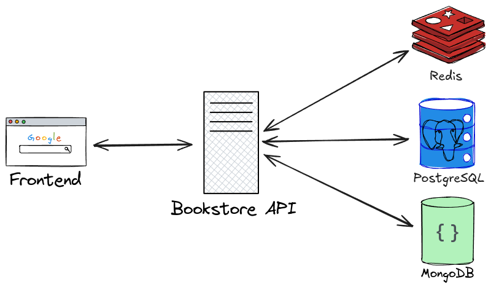

# Compulsory Assignment #2
In this project three databases are used: PostgreSQL, MongoDB, and Redis.  
The first two databases are used for storing buisness logic.   

- PostgreSQL stores Books and their Authors, vital data about the product that is being sold.
- MongoDB stores information about the Customers and their Orders.  

A caching layer is implemented using Redis, and is provided only for the Books and Authors, as these are the most requested data points in the system.  

  

  

## Design choices
The choice of PostgreSQL for storing product information was that it is very modular for integration with external systems, as well as the data models it should contain, being very rigid and unchanging.  

MongoDB was chosen for the cusomter infomation and orders, as these data models are likely to change, and because the schema of MongoDB is very adaptable to these changes. 
Additonally, MongoDB is able to achieve higher transactional speeds, compared to PostgreSQL.
